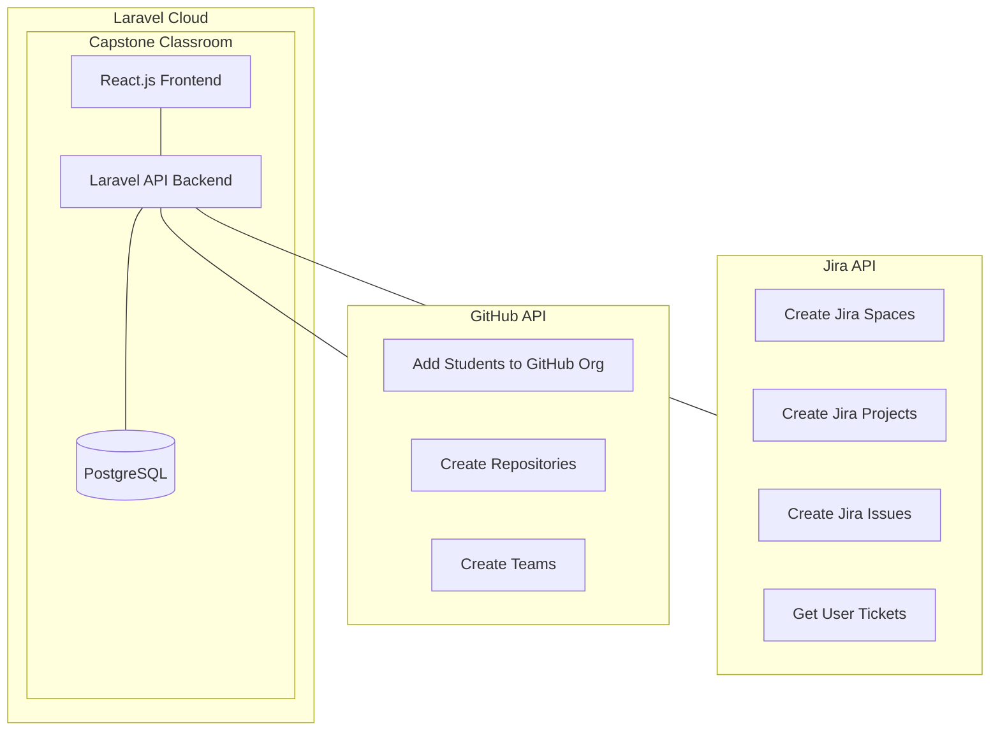

# Welcome to Capstone Classroom

## Motivation
In May 2026, Microsoft decided to rug pull GitHub Classroom, leaving educators and students without a reliable platform for managing their coding assignments. This sudden change created a significant gap in the educational technology landscape, prompting the need for a new solution.

Other solutions such as Classroom50, do not fit Capstone Project courses as they are designed for coding assignments that must be private, have auto grading, 

You might ask why did capstone courses choose GitHub Classroom in the first place? Onboarding. Onboarding students to GitHub Classroom was relatively easy, and it provided a seamless experience for both instructors and students. The platform allowed for efficient distribution of assignments, tracking of student progress, and integration with GitHub repositories, which are essential for coding projects. The alternative now is to manually create repositories for each student, which is time-consuming and error-prone.

## Designed for Temple University's Projects in Computer Science Capstone Course 
Temple University's CIS 4398 Projects in Computer Science, the final Computer Science course, involves a team-based software development project using agile methodologies and industry-standard tools like Jira, Docusaurus, and GitHub. The course emphasizes user-centricity, goal-drivenness, process-orientation, and teamwork.

## Capstone Classroom Features
1. **Seemless Onboarding to GitHub**: No complex setup required. Students can easily connect their GitHub accounts to Capstone Classroom, allowing for a smooth transition from the previous platform.
2. **Automated Repository Creation**: Instructors can create repositories for each student with a single click, eliminating the need for manual setup and reducing the risk of errors. It will scaffold the Documentation Template for each project, ensuring that students have a consistent starting point for their work.
3. **Jira Integration**: Connect Student's Jira accounts and Jira Spaces to Capstone Classroom, enabling instructors to track student progress and see how they're progressing both individually and as a team.

## Architecture
The architecture of Capstone Classroom is designed to be easily maintained. It uses Laravel, a PHP framework that provides a robust foundation for building web applications. The front-end is built using React.js, a progressive JavaScript framework that allows for the creation of dynamic and interactive user interfaces. The back-end is powered by Laravel, which handles server-side logic, database interactions, and API integrations.

